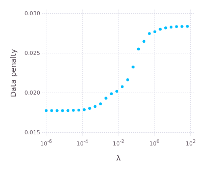
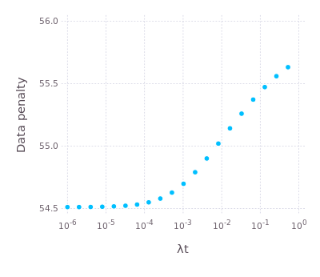

# BlockRegistration

[](https://magnum.travis-ci.com/HolyLab/BlockRegistration)

## Installation

Install the package from the Julia prompt with
```jl
Pkg.clone("url")
```
where `url` is the "clone URL" on this page.

Next, build it with the following statements:
```jl
Pkg.build("BlockRegistration")
using BlockRegistration
import RegisterMismatch
import RegisterMismatchCuda
```

The last two lines are needed to precompile the modules
`RegisterMismatch` and `RegisterMismatchCuda`. `BlockRegistration`
does not include these modules because they are not intended to be
used at the same time; either one or the other gets loaded depending
on choices you make.

You may want to execute those "building" lines every time
`BlockRegistration` updates.

## General usage

Begin with `using BlockRegistration`.  The code is organized as a set
of modules, of which the main ones likely to be of interest to users
are:

- `RegisterCore`: basic types and the overall framework
- `RegisterDeformation`: deformations (warps) of space
- `RegisterMismatch`/`RegisterMismatchCuda`: computing mismatch data from raw images
- `RegisterFit`: approximating mismatch data with simple models
- `RegisterPenalty`: regularized objective functions for use in optimization
- `RegisterOptimize`: performing optimization to align images
- `RegisterGUI`: utilities for visualizing mismatch data and the overlap of images

You can invoke help with `?` followed by the name of a module; for
example, `?RegisterCore` will provide an overview of the
`RegisterCore` module (a good place to start if you're trying to get a
handle on the basic underpinnings).

Also consider looking at the code in `test` as an example of how to
use these modules.

## Stack-by-stack optimization

For large images you might prefer the "stack-by-stack registration"
section of
[BlockRegistrationScheduler](https://github.com/HolyLab/BlockRegistrationScheduler).
If you're using the scheduler, many parts of the rest of this README
do not apply.

If you want to use BlockRegistration directly, then you might consider
something like this:

```julia
using FileIO, Images, Unitful, StaticArrays, AxisArrays, ProgressMeter
using BlockRegistration
using RegisterMismatch  # no CUDA (see BlockRegistrationScheduler)

# Some physical units we may need (from the Unitful package)
const μm = u"μm"  # micrometers
const s  = u"s"   # seconds

img = load("myimage")  # filename of your image
# Note: if you're loading from a file type that doesn't return an AxisArray,
# add something like this:
#    img = AxisArray(img, (:y, :x, :time), (Δy, Δx, Δt))  # for 2d images + time
# where Δy, Δx is the pixel spacing along y and x, respectively, and
# Δt the time between successive frames. (The latter isn't really used for anything.)
# For example:
#    img = AxisArray(img, (:x, :y, :time), (1.15μm, 1.15μm, 2s));

# If you need to select a region of interest, do something like
#    img = view(img, 150:800, 50:600, :)

# Now select your reference ("fixed") image. This chooses the middle
# frame/stack, assuming you've set a :time axis
fixedidx = (nimages(img) + 1) ÷ 2  # ÷ can be obtained with "\div[TAB]"
fixed = img[timeaxis(img)(fixedidx)];

# Important: inspect fixed to make sure it seems OK! You don't want to
# align to an image with an artifact.

# You can conceivably filter your image if you want, see the Images documentation

## With the preliminaries out of the way, let's get started. Specify a few parameters
# Choose the maximum amount of movement you want to allow
mxshift = (30, 30)  # 30 pixels along each spatial axis for a 2d+time image
# Pick a grid size for your registration. Finer grids allow more
# "detail" in the deformation, but also have more parameters and
# therefore require higher SNR data.
gridsize = (15, 15)
# Pick a threshold for sufficiency of data. This effectively requires
# that we have at least 1/4 of a grid-block's worth of data before we
# take any results seriously.
thresh_fac=(0.5)^ndims(fixed)
thresh = (thresh_fac/prod(gridsize)) * length(fixed)
# Set λrange. See info below. You can alternatively choose a single number, e.g.,
#     λrange = 0.003
λrange = logspace(-6, 0, 13)

## A few items can be calculated/allocated in advance
cs = coords_spatial(img)   # which axes correspond to spatial coordinates?
aperture_centers = aperture_grid(size(img, cs...), gridsize)
aperture_width = default_aperture_width(fixed, gridsize)
knots = map(d->linspace(1,size(fixed,d),gridsize[d]), (1:ndims(fixed)...))

E0 = zeros(gridsize)
cs = Array{Any}(gridsize)
Qs = Array{Any}(gridsize)

ap = AffinePenalty(knots, first(λrange))

# Now loop over each timeslice
ϕs = []
# If you want to monitor some of the internal variables, you can mimic
# the use of ϕs above and below
@showprogress 1 for tidx in indices(img, Axis{:time})
    moving = view(img, timeaxis(img)(tidx))
    # Compute the mismatch
    mms = mismatch_apertures(fixed, moving, aperture_centers, aperture_width, mxshift)

    # Some cameras generate fixed-pattern noise. In such cases you
    # might want to get rid of it. But _don't_ do this unless you know
    # you need to, because bias correction can easily make the
    # registration worse.
    correctbias!(mms)

    # Construct a quadratic fit to the mismatch data in each block of the grid
    # We'll use this to help initialize the deformation to a good starting value.
    for i = 1:length(mms)
        E0[i], cs[i], Qs[i] = qfit(mms[i], thresh; opt=false)
    end

    # Prepare for optimization
    mmis = interpolate_mm!(mms)
    if isa(λrange, Number)
        ϕ, mismatch = RegisterOptimize.fixed_λ(cs, Qs, knots, ap, mmis)
    else
        ϕ, mismatch, λ, λs, dp, quality = RegisterOptimize.auto_λ(cs, Qs, knots, ap, mmis, λrange)
    end
    push!(ϕs, ϕ)  # save the result for later use
end
```

If you prefer, you can put everything after the parameter settings
(`maxshift`, `gridsize`, `thresh`, and `λrange`) into a function that
you reuse across experiments.

Once you have `ϕs`, see the section on warping below.

## Whole-experiment optimization

In general you'll use this in conjunction with
`BlockRegistrationScheduler`. If you're using the
`RegisterWorkerAperturesMismatch` module, then here you're most likely
interested in "stage 2," in which you use the pre-calculated mismatch
data to define the deformations that will align the images.

### Read the data

```jl
using JLD
using BlockRegistration

fnmm = "exp8_20150818.mm"
Es, cs, Qs, knots, mmis = jldopen(fnmm, mmaparrays=true) do file
    read(file, "Es"), read(file, "cs"), read(file, "Qs"), read(file, "knots"), read(file, "mmis")
end;
```

`Es`, `cs`, and `Qs` are the parameters of the quadratic fit of the
aperturewise mismatch (see `qfit`)---they provide an efficient proxy
for operations that would otherwise need mismatch data. `knots`
defines your grid of apertures, and `mmis` is the array containing the
mismatch data.

### Determine the appropriate regularization coefficients

There are two coefficients, `λ` and `λt`, whose value you need to
set. `λ` is the regularization penalty coefficient for the **spatial**
deformation; in particular, higher `λ` force the deformation to be
more and more affine-like (see `AffinePenalty`).  To set the value of
`λ`, from here perhaps the easiest approach is to use `auto_λ`. (An
alternative is to use the `RegisterWorkerApertures` worker, see the
`apertured1` test script.) To use this function, you'll want to pick a
particular image, here we'll say stack 37:

```jl
ϕ, penalty, λ, λs, datapenalty, quality = auto_λ(37, cs, Qs, knots, mmis, (λmin, λmax))
```

You have to supply values for `λmin`, `λmax` (good starting points
might be `λmin=1e-6` and `λmax=100`, but see below). The value of `λ`
is the one selected automatically for you. However, it's probably a
good idea to plot the results for all tested values. Using `Immerse`
(or `Gadfly`), this would be:

```jl
plot(x=λs, y=datapenalty, xintercept=λ, Geom.point, Geom.vline, Guide.xlabel("λ"), Guide.ylabel("Data penalty"), Scale.x_log10)
```

For example:



You want to see the whole sigmoid; adjust the values of `λmin`, `λmax`
as needed to achieve this. The general idea is to choose `λ` as a
value where it's just beginning to have an effect on the quality of
the registration (meaning, just beginning increase the value of the
data penalty).  Here, good choices range from 10^-3 to 10^-2.

You should try several different images and come to a reasonable
consensus about a good choice for `λ`.

Once you've chosen `λ`, you're ready for `λt`, the coefficient of the
**temporal** penalty.  Larger `λt` increase the consistency of the
selected deformations from one stack to the next. Set this value as follows:

```jl
ap = AffinePenalty(knots, λ)
λts, datapenalty = auto_λt(Es, cs, Qs, ap, (λtmin, λtmax))
```

Now plot `datapenalty` against `λts` on a log-scale as above, and (as
a starting guess) again select the value that just begins to affect
the data penalty.



In general I've found that `λt` takes a bit more experimentation than
`λ`, and that in the end I make my judgement by how the warped
sequence of images looks.

### Perform the optimization

Now that you've selected values for the regularization coefficients, you're ready to perform the optimization:

```jl
# Illustrative choices of λ and λt. There's no reason these need to be the same.
λ = 0.003
λt = 0.003

ap = AffinePenalty(knots, λ)
ϕs, penalty = fixed_λ(cs, Qs, knots, ap, λt, mmis; show_trace=true, iterations=10000)
outname = string(splitext(fnmm)[1], ".def")
@eval @save $outname ϕs penalty λ λt
```

This is likely to run for quite a long time. The end result will be a
file `"exp8_20150818.def"` (given our choice above for `fn`) that
stores the deformation `ϕs` and other data.

### Warping the images

Now load your image file. Be sure to extract and apply `roi` if you
performed registration on a sub-region of the image:
```jl
img = load(fn, mode="r")
roi = jldopen(fn, mmaparrays=true) do file
    read(file, "roi")
end
img = subim(img, roi..., :)
```
or you'll get wrong results.

Now apply the deformations:
```jl
open("my_registered_image.cam", "w") do file
    warp!(Float32, file, img, ϕs; nworkers=3)
end
```

Make a copy of the original `.imagine` file into this directory,
edit the size for your `roi` (if needed) and set `pixel data
type=single`, and you should be ready to inspect the results.

### Troubleshooting

This "package" is unconventional in having many stand-alone modules in
a single repository; this design is used in part because we are
limited by GitHub to a maximum of 20 private repositories. Certain
complications arise as a consequence, of which the most common is
that, depending on usage patterns, julia may complain about not being
able to find certain modules.  In (hopefully) all cases, such errors
can be avoided if you begin your usage with `using BlockRegistration`:
the `BlockRegistration` module adds the proper path to julia's
`LOAD_PATH` variable, making it possible to find the remaining
modules.

This same issue arises particularly when using multiple processes via
`BlockRegistrationScheduler`, and is particularly problematic for
`RegisterMismatch` and `RegisterMismatchCuda` since these do not get
built when you type `using BlockRegistration`. If you run into
problems with julia unable to build or execute certain functions,
please try the building steps listed above under "Installation" in a
single-process julia session. Then start a fresh julia session and try
your task again.
