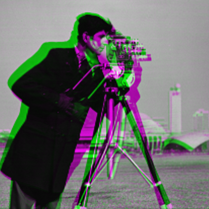

# [Stack-by-stack optimization: a cookbook](@id cookbook)

For practical use with large images you might prefer the "stack-by-stack registration"
section of
[BlockRegistrationScheduler](https://github.com/HolyLab/BlockRegistrationScheduler).
If you're using the scheduler, many parts of the rest of this cookbook
do not apply.
However, if your goal is to learn the internals, it's easier and more informative to start with BlockRegistration.

Let's start with a simple two-dimensional demonstration.
The code below is heavily annotated to explain what each step does.

```jldoctest cookbook; filter=[r"Planning.*", r"Progress.*"]
using FileIO, Images, Unitful, StaticArrays, ProgressMeter
using AxisArrays: Axis, AxisArray
using BlockRegistration
using RegisterMismatch  # no CUDA

# Some physical units we may need (from the Unitful package)
const μm = u"μm"  # micrometers
const s  = u"s"   # seconds

# Load your image (movie) into a variable called `img`.
# It might look like this:
#     img = load("myimage")  # filename of your image
# Here we will just use a demo script (see the `test/` directory)
brdir = dirname(dirname(pathof(BlockRegistration)))   # directory of BlockRegistration
include(joinpath(brdir, "test", "gen2d.jl"));          # defines `img`

# Note: if you're loading from a file type that doesn't return an AxisArray,
# add something like this:
#    img = AxisArray(img, (:y, :x, :time), (Δy, Δx, Δt))  # for 2d images + time
# where Δy, Δx is the pixel spacing along y and x, respectively, and
# Δt the time between successive frames. (The latter isn't really used for anything.)
# For example:
#    img = AxisArray(img, (:x, :y, :time), (1.15μm, 1.15μm, 0.2s));

# If you need to select a region of interest, do something like
#    img = view(img, 150:800, 50:600, :)

# Now select your reference ("fixed") image. This chooses the middle
# frame/stack, assuming you've set a :time axis
fixedidx = (nimages(img) + 1) ÷ 2  # ÷ can be obtained with "\div[TAB]"
# Note: this next line extracts the timeslice.
# This is like `img[:, :, t]` or `img[:, :, :, t]` but it
# works for any dimensionality or ordering of the dimensions.
fixed = img[timeaxis(img)(fixedidx)]

# Important: inspect fixed to make sure it seems OK! You don't want to
# align to an image that happens to have an artifact.

# At very low SNR you might consider smoothing both fixed and moving before running
# registration (see the JuliaImages documentation)

## With the preliminaries out of the way, let's get started. Specify a few parameters.
# Choose the maximum amount of movement you want to allow (set this by visual inspection)
mxshift = (30, 30)  # 30 pixels along each spatial axis for a 2d+time image
# Pick a grid size for your registration. Finer grids allow more
# "detail" in the deformation, but also have more parameters and
# therefore require higher SNR data.
gridsize = (3, 3)   # it's fine to choose something anisotropic
# Pick a threshold for sufficiency of data. The aim of this parameter is to prevent
# the algorithm from considering solutions where the two images barely have any overlap,
# e.g., where the algorithm chooses to align images
#        A  A  A                  B  B  B
#        A  A  A       and        B  B  B
#        A  A  A                  B  B  B
# as
#                 A  A  A
#                 A  A  A
#                 A  A  O  B  B      (O = overlap region)
#                       B  B  B
#                       B  B  B
# just to get all the high-SNR regions "out of the way".
#
# The choice below effectively requires that we have at least 1/4 of a
# grid-block's worth of data before we take any results seriously.
thresh_fac=(0.5)^ndims(fixed)
thresh = (thresh_fac/prod(gridsize)) * length(fixed)
# Set λrange. See info below. You can alternatively choose a single number, e.g.,
#     λrange = 0.003
λrange = (1e-6, 1.0)    # (lo, hi)

## Calculated and pre-allocated parameters
# grid geometry
aperture_centers = aperture_grid(size_spatial(img), gridsize)
aperture_width = default_aperture_width(fixed, gridsize)
nodes = map(axes(fixed), gridsize) do ax, g
    range(first(ax), stop=last(ax), length=g)
end
# allocate storage for quadratic model of blockwise mismatch data
E0 = zeros(gridsize)
cs = Array{Any}(undef, gridsize)
Qs = Array{Any}(undef, gridsize)

# AffinePenalty handles regularization, penalizing any deformation in proportion to
# the degree to which it disagrees with its own best-fit affine transformation.
# λ (via λrange) specifies the weighting of this deformation penalty.
ap = AffinePenalty(nodes, first(λrange))

# Now loop over each timeslice
ϕs, λs, errs = AbstractDeformation[], [], []  # storage for results (the deformation, chosen λ, and resid for each timeslice)
@showprogress 1 for tidx in axes(img, Axis{:time})
    moving = view(img, timeaxis(img)(tidx))

    # Compute the mismatch for all deformations that are piecewise-constant
    # over the grid.
    mms = mismatch_apertures(fixed, moving, aperture_centers, aperture_width, mxshift)

    # Some cameras generate fixed-pattern noise, which acts as an "anchor"
    # preventing movement. Even if you can't see the fixed-pattern noise by
    # eye, its cumulative effect over an entire block can be substantial.
    # The hallmark is a "cross" pattern centered on the middle of each block of `mms`,
    # which introduces a bias to choose a shift of 0 on a per-coordinate basis.
    #
    # The commented-out command below attempts to discard this noise.
    # _Don't_ use it unless you know you need to, because bias correction can
    # easily make the registration worse.
    # On more modern sCMOS cameras this may not be necessary.
    # correctbias!(mms)

    # Construct a quadratic fit to the mismatch data in each block of the grid
    # We'll use this to help initialize the deformation to a good starting value.
    for i in eachindex(mms)
        E0[i], cs[i], Qs[i] = qfit(mms[i], thresh; opt=false)
    end

    # Prepare for optimization
    mmis = interpolate_mm!(mms)
    if isa(λrange, Number)
        # We've specified a particular value for λ
        ϕ, mismatch = fixed_λ(cs, Qs, nodes, ap, mmis)
        λ = λrange
    else
        # We've specified a range for λ. Try to choose a "good value" (see below)
        ϕ, mismatch, λ, λvec, dp, quality = auto_λ(cs, Qs, nodes, ap, mmis, λrange)
    end
    # Save the result for later use. Of course you can save more data than this,
    # e.g., the value of the mismatch might be an indication of quality.
    push!(ϕs, ϕ)
    push!(λs, λ)
    push!(errs, mismatch)
end

all(errs .< 0.03)

# output

true
```

If you prefer, you can put everything after the parameter settings
(`maxshift`, `gridsize`, `thresh`, and `λrange`) into a function that
you reuse across experiments.

Let's look at the results.
When you're registering "big data," you will usually need to save the warped images to disk:

```julia
# .cam is from ImagineFormat.jl (or use NRRD, etc.)
open("my_registered_image.cam", "w") do file
    warp!(Float32, file, img, ϕs; nworkers=3)
end
```

But if you're testing this on the small demo in `"test/gen2d.jl"`, we can do it in memory:

```jldoctest cookbook; filter="\".*"
# Allocate storage for the warped image
imgw = similar(img, Gray{Float32});   # eltype needs to be able to store NaN
for i = 1:nimages(img)
    # Apply the deformation to the "recorded" image
    imgw[:,:,i] = warp(img[:,:,i], ϕs[i])
end
```

## [Visualizing the results](@id results)

You can check the results with

```julia
using ImageView
imshow(imgw)
```

If you try this demo, you'll see the strengths and weaknesses of BlockRegistration:
for a "minimize the mean square difference" algorithm it's quite fast,
and the warped image is better than the original, but it's certainly not perfect.
For example, here is an overlay of the fixed image (the middle frame in the movie) in magenta and the first moving image (the first image in the movie) in green:

|  Original  |  Aligned  |
| ---------- | --------- |
|  |  |

You can see the corrected alignment is quite good; the original has a fair amount of misalignment (as evidenced by the magenta and green, which indicates different intensities in the fixed and moving image), whereas after motion correction the two line up fairly closely (most pixels are very close to pure grayscale).

But now let's look at the last image in the series, which has a different deformation:

|  Original  |  Aligned  |
| ---------- | --------- |
|  |  |

The aligned pair is certainly better, but far from perfect.

Next we dive a bit deeper to explain a few key features of this approach,
and to explore some of the ways you can improve on these results.
