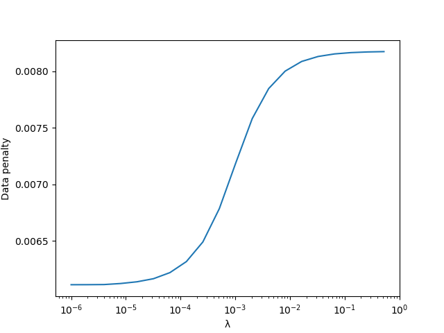

# Components of registration

## Apertured mismatch

As described in the documentation for [RegisterCore](https://github.com/HolyLab/RegisterCore.jl),
the mismatch between images is represented using an array where each element corresponds to a shift (translation) of a block of the image.
From the demo in the [cookbook](@ref), we can select a particular moving image,
compute the mismatch, and visualize it:

```jldoctest cookbook
moving = img[:,:,1]
mms = mismatch_apertures(fixed, moving, aperture_centers, aperture_width, mxshift)
# Turn the mismatch from NumDenom to a plain ratio (see RegisterCore docs)
rat(x) = ratio(x, thresh)
mmsr = map(mm->rat.(mm), mms)
# Concatenate so we can see the whole 3×3 grid of mismatch arrays
mmall = hvcat((3,3,3), parent.(mmsr)...)
maximum(mmall)
```

If you visualize `mmall`, you'll see something like this:


This is a heatmap representing the mismatch data in each element of the 3×3 grid of apertures.
The center of each square corresponds to "no shift"; as one moves towards the edge one gets to the `mxshift` that we chose.
Darker means lower mismatch (with zero being black), and lighter meaning higher mismatch.
For example, the left-center aperture has a minimum that is displaced vertically from the center; if you look back at the images at the end of the previous page, you can convince yourself that the left side of the moving image is indeed shifted vertically.
This aperture's minimum is also relatively isotropic, reflecting the fact that the image has "features" that define both the vertical and horizontal shift with approximately similar precision.
Conversely, in other regions
the penalty for some movements is quite different from the penalty for others.
For example, the right-center aperture is "forgiving" of shifts that have only a slight tilt from vertical; this is because the tripod leg on the right side of the image is the highest-contrast feature, and sliding along the axis of the leg introduces much less mismatch than sliding perpendicularly to the leg.

## Regularization

The "naive" optimum deformation is set by choosing the lowest value in each of these apertures.
However, because some apertures have very little to constrain them (e.g., lower left),
we additionally enforce "smoothness" in the deformation with the `AffinePenalty`,
whose magnitude it set by `λ`.
You can specify the value of `λ` yourself, or you can allow the algorithm to choose it for you.

If one repeats the calculation in our cookbook up through `auto_λ`,
plotting `λvec` (vector of tested `λ` values) vs `dp` ("data penalty") yields the
following graph:



Larger values of `λ` force the deformation to become closer to an affine transformation.
Since the actual underlying transformation is *not* affine, large `λ` values
force the optimizer to choose a lower-quality alignment in order to make the deformation affine.
For this reason, the data penalty is higher at large `λ`.

Roughly speaking, `auto_λ` attempts to choose `λ` so that one is near the lower kink in the sigmoid---where `λ` is starting to make a difference, but that you're still dominated by the data.
To ensure that this happens correctly, you need to choose a `λrange` that effectively spans the sigmoid.

The automatic choice may not be ideal (and it certainly takes more computation time),
so you might consider experimenting with different `λ` and seeing which choice gives
the best alignment.
