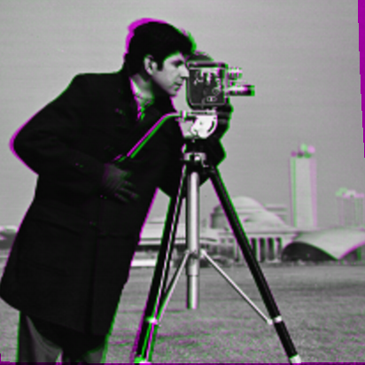

# Improving alignment

In the [cookbook](@ref results), the last timeslice was particularly poorly aligned with the fixed image.
Here we explore some options for improving the results.

## Adjusting `λ`

The value chosen by `auto_λ` should be viewed as a guide only; in particular, if you're
registering a large data set, the fact that `auto_λ` runs many registrations of the same
image pairs means it will take a long time. One good approach is to run `auto_λ`
on a small subset of stacks and see what kind of values it picks; then, adopt something
similar as a *fixed* value of `λ` for the whole experiment.

In practice it often seems to choose too large of a value; if we re-run the [cookbook](@ref cookbook)
with a fixed value of `λ = 1e-6`, we seem to do somewhat better on that troublesome [final image](@ref results):


## Iterative refinement

It is possible to use the solution as an initializer to iteratively improve the alignment.
The idea is that

```jldoctest cookbook
moving = img[:,:,end]
ϕ1 = ϕs[end]
movw1 = warp(moving, ϕ1)
```

represents a closer match to `fixed` than `moving` itself; we can then calculate
a `ϕ2` that aligns `movw1` to `fixed` and then compose them:

```jldoctest cookbook
mms = mismatch_apertures(fixed, movw1, aperture_centers, aperture_width, mxshift)
for i in eachindex(mms)
    E0[i], cs[i], Qs[i] = qfit(mms[i], thresh; opt=false)
end
mmis = interpolate_mm!(mms)
ϕ2, mismatch = auto_λ(cs, Qs, nodes, ap, mmis, λrange)
```

`ϕ2` should approximately align `movw1` to fixed, and consequently

```jldoctest cookbook
using Interpolations
ϕtot = interpolate(ϕ1)(ϕ2)
```

should align `moving` to fixed:


You can see that this is a somewhat better alignment than our [first attempt](@ref results).
One does not have to stop at a first iteration, one can repeat this process for as long as it continues to improve the alignment.

## Changing the grid size

Another approach is to use more grid points, allowing a more fine-scaled deformation:

```julia
gridsize = (9, 9)

...
# repeat all the other calculations for the final image in the time series
...

movw = warp(moving, ϕ)
imshow(colorview(RGB, fixed, movw, fixed); name="9x9")
```


The "wobble" in the leg is an indication that the increasing number of degrees of freedom is making it harder to determine the correct deformation on the finest scales.
It can take some experimentation to find grid sizes that work well.

## RegisterHindsight

So far, every operation we've used works *prospectively*:
we try to predict the mismatch based on shifting entire blocks of the image,
and we adopt the deformation that minimizes this prospective mismatch.
More conventional registration frameworks directly model the mismatch associated with
`moving(ϕ(x))` and perform descent on `ϕ`.
[RegisterHindsight](https://github.com/HolyLab/RegisterHindsight.jl) lets you optimize `ϕ` in this manner:

```jldoctest cookbook
moving, ϕ0, λ = img[:,:,end], ϕs[end], λs[end]
ϕ = interpolate!(copy(ϕ0))        # not the same as `interpolate(ϕ0)`, see docs
ap = AffinePenalty(ϕ.nodes, λ/100)   # note /100! `auto_λ` often seems to choose high
p, p0 = RegisterHindsight.optimize!(ϕ, ap, fixed, moving)
```

If you warp `moving` you obtain the following:



You can see this is considerably better, though of course it was far slower.

If you see the registration gets *worse*, it's almost surely a sign that `λ` was too high.
